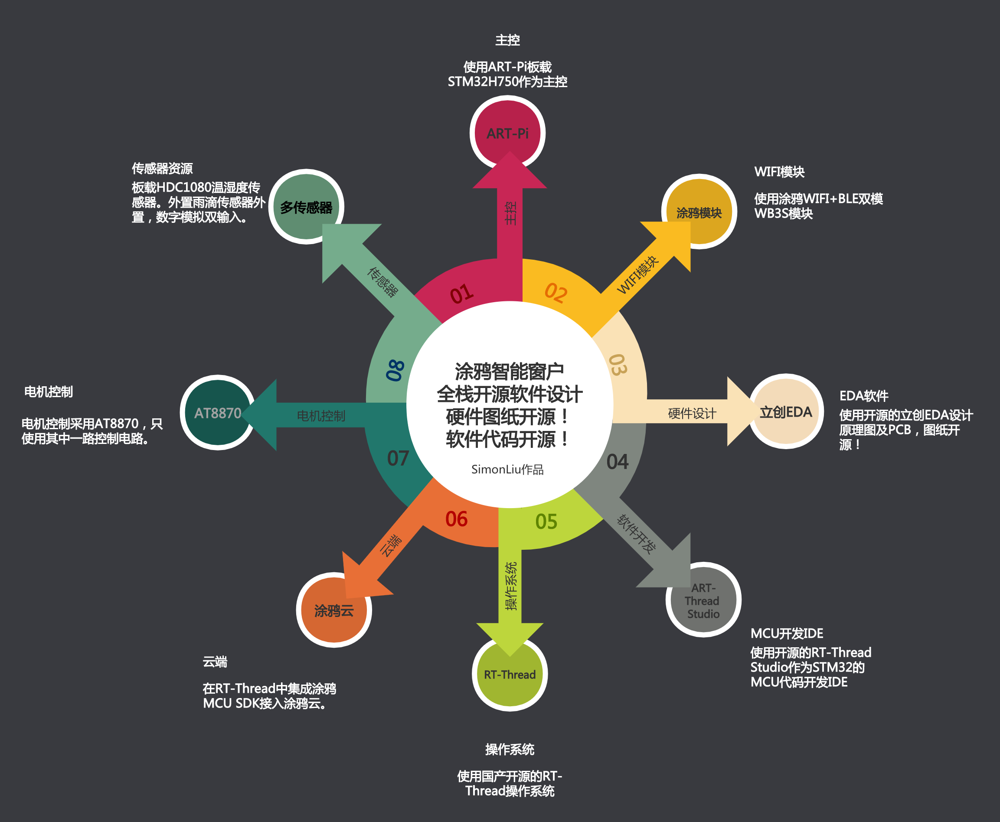
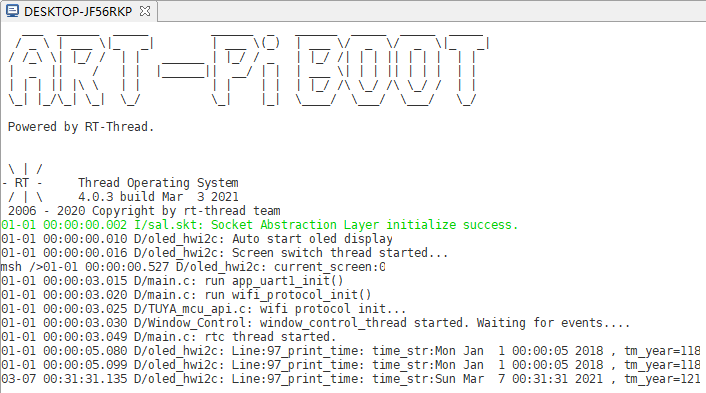

This project is developed using Tuya SDK, which enables you to quickly develop branded apps connecting and controlling smart scenarios of many devices.
For more information, please check Tuya Developer Website.



# 硬件设计
本项目包含了一个AT8870 H桥驱动，用于驱动电机。以及外置一个雨滴传感器接口，板载一个温湿度传感器。ART-Pi板载的AP6212无法接入涂鸦，所以改为使用涂鸦WB3S模块，通过MCU接入方式连接涂鸦云，操作系统采用RT-Thread，将涂鸦MCU SDK集成到RT-Thread项目中。MCU开发IDE使用RT-Thread Studio。

硬件设计开源，[点击查看。](https://oshwhub.com/simonliu009/tu-ya-xun-lian-ying2-zhi-neng-chuang-hu-kong-zhi-qi-272650a) 

# 软件设计

1. 软件工程由RT-Thread Studio中创建，由于涂鸦模块的MCUSDK处理了所有网络请求，所以没有使用任何RT-Thread软件包。项目使用了RT-Thread软件RTC。NTP时间同步以及天气信息获取都从MCU SDK实现。
2. 项目充分利用了RT-Thread的多线程特性，使用事件来实现线程之间的相互通讯。
3. 项目使用了RT-Thread自动初始化的特性，所以在main()中基本看不到其他初始化函数。

## 源文件简要说明：
```shell
├─applications
│  │  app_event.c //事件和全局变量
│  │  app_event.h
│  │  app_gpio.c  //配网按键相关
│  │  app_oled_hwi2c.c //oled显示相关
│  │  app_ti_hdc1080.c //温湿度传感器相关
│  │  app_uart.c        //串口及天气相关
│  │  app_uart.h        
│  │  app_window_control.c  //电机控制相关
│  │  main.c                //入口文件
│  │  oled.c                //OLED驱动相关
│  │  oled.h
│  │  oledfont.h            //OLED字体相关
|  |-- mcusdk               //tuya MCU SDK
```
Note: 项目已移除了真实产品的PRODUCT_KEY

